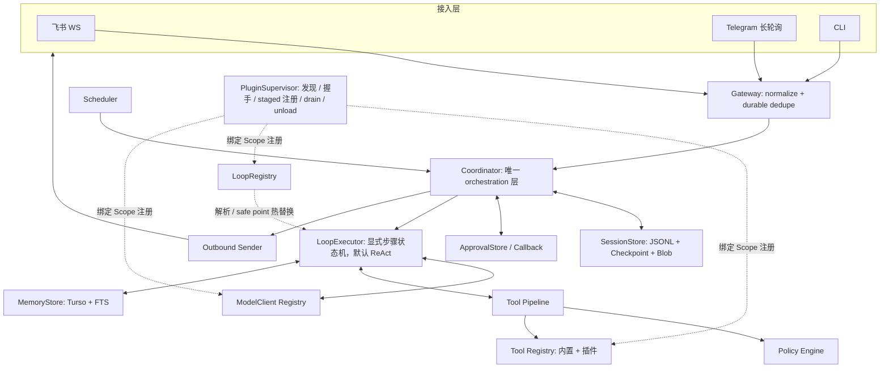
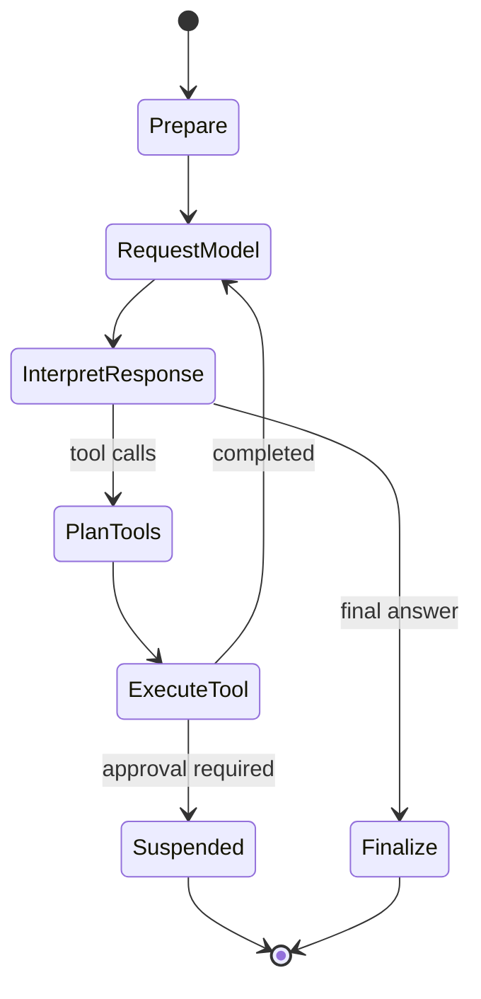
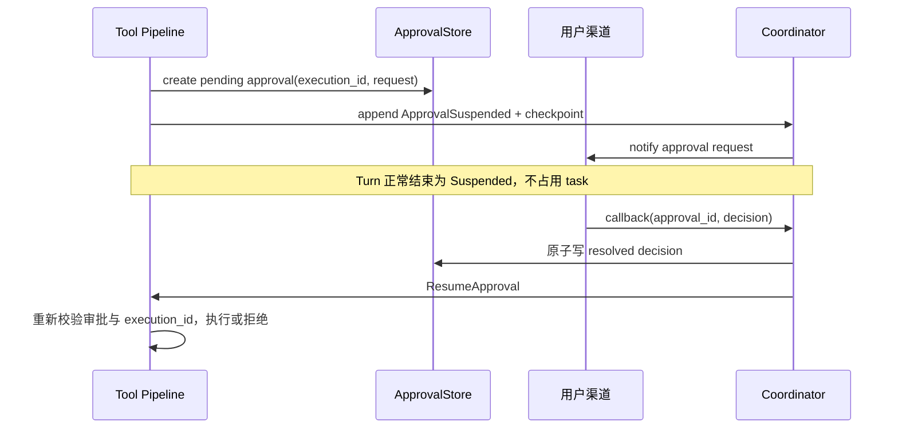
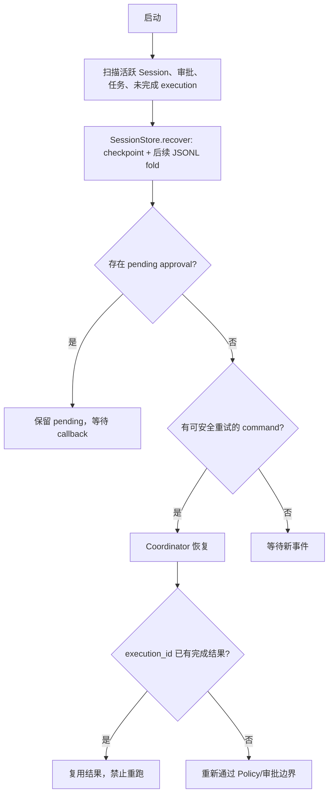

# riko：个人常驻 Agent 助手（精简版架构 + 实施计划）

> 状态：实施基线（合入 Process 插件热替换与内核 crate 拆分决策）  
> 适用范围：单用户、7×24 运行在家用小主机上的本地优先个人 Agent。

## 1. 目标与边界

riko 是一个通过飞书、Telegram 和 CLI 持续接收任务、调用模型与本地工具、保存可审计状态，并在高风险操作前取得用户批准的个人 Agent。它不是多租户 Agent 平台，也不追求运行时任意热插拔。

### 1.1 目标

- 单一事实来源：会话事实以追加式 JSONL 事件日志为准，Checkpoint 只是可再生的工作上下文投影缓存。事件日志必须存储完整内容（大内容以 blob 引用），保证投影可从日志完整重建。
- 可恢复：进程崩溃后从 Event Log 和 Checkpoint 恢复；不得因恢复重复触发有副作用的工具。
- 可治理：所有工具经过统一 Policy 与 Approval 管线，批准可跨进程恢复。
- 可扩展：能力边界一律是稳定、可序列化的协议。内置能力走编译期新增 + 配置选择；外部 Tool、AgentLoop、Provider、Memory 后端走 **Process 插件（JSON-RPC over stdio）**，Runtime 不重启即可发现、装载、替换与卸载。
- 可替换：AgentLoop 状态外置为 `VersionedState`，只在 safe point 切换，state schema 变更走显式 `migrate`；迁移或初始化失败保持旧 Loop 与旧状态继续运行，不提交半完成切换。
- 本地优先：会话、记忆、调度与审计数据存储在本机；模型调用只发送完成本次任务所必需的上下文。
- 缓存稳定：prompt 按前缀缓存，上下文一律**按变化频率排序**，稳定的在前、易变的在后；组装是确定性纯函数，同一份会话事实每次产生逐字节相同的 prompt（§9.5）。

### 1.2 非目标

- 多用户隔离、组织级 RBAC、插件市场。
- 强隔离的第三方代码执行环境：Process 后端只提供 OS 级进程隔离与最小环境，**不承诺可安全运行不可信第三方代码**。插件默认视为用户自己安装的可信代码。
- 分布式调度、高可用集群、跨节点一致性协议。
- 自动执行未被 Policy 允许或需要人工批准的外部副作用。

**本基线之外、后续阶段再评估**（列在此处是为了避免被误当作已否决）：WASM 组件后端与能力式沙箱、插件签名与信任链、资源配额计量。届时新增的是一个后端实现，Tool / Loop / Provider 的协议与治理路径不变——这正是现在把边界定成可序列化协议的原因。

## 2. 技术选型

| 领域 | 选型 | 约束 |
|---|---|---|
| 语言与运行时 | Rust、tokio | 单进程常驻服务 |
| HTTP | reqwest + rustls | 不依赖系统 TLS |
| 模型 | Claude Messages API；OpenAI Responses API | 统一 `ModelClient`；OpenAI 使用 `store:false`，不用 `previous_response_id`，状态由 riko 管理；动态扩展见 §6.1 |
| 插件后端 | Process：JSON-RPC over stdio | 唯一动态扩展通道；`runtime/initialize` 握手取协议与能力交集；调用携带 request / session / trace / deadline，支持取消、心跳与受控关闭；见 §11 |
| AgentLoop | `LoopExecutor` 协议 + 外置 `VersionedState` | 内置 ReAct 是默认实现而非唯一实现；safe point 热替换，见 §9 |
| 事件日志 | JSONL + blob store | 每个 Session 追加写；>8KB 内容落 `data/blobs/<sha256>`，事件存引用；定期 checkpoint |
| 结构化存储 | Turso + Toasty ORM | 记忆、调度、去重、审批索引；复杂 FTS 允许直接使用 turso SQL |
| 记忆检索（默认） | Embedding 向量检索（Turso 原生向量列 + `vector_top_k`）+ FTS 混合，RRF 合并 | `EmbeddingClient` port，`kind = "openai_embeddings"`（OpenAI 兼容端点，覆盖本地 Ollama/vLLM 与云服务）；多语言默认 bge-m3（本地）或 text-embedding-3-large（云），配置切换 |
| 全文检索 | Turso Tantivy FTS | 混合检索的关键词信号 + embedding 不可用时的降级路径；处于实验状态，藏在 `MemoryStore` 后 |
| 时间 | time | `OffsetDateTime` + RFC3339 serde，不使用 chrono |
| cron | croner | 仅解析表达式，调度循环自行实现 |
| 飞书 | openlark（先验证 WS 长连接） | 失败时以 tokio-tungstenite 自封适配器替代 |
| Telegram | reqwest | 仅 `getUpdates` 长轮询、`sendMessage` 等必要端点 |

## 3. 总体架构



### 3.1 分层职责

| 组件 | 所在 crate | 负责 | 不负责 |
|---|---|---|---|
| Gateway | riko-gateway | 平台事件接收、规范化（含命令/回调解析）、持久化去重、发送适配 | 会话编排、模型调用 |
| Coordinator | riko-app | 唯一编排入口；建立 Turn、加载/持久化状态、调 Agent、恢复审批与定时任务 | 领域状态折叠细节、平台协议细节 |
| SessionStore | riko-session | `append`、`fold`、`checkpoint`、`recover`、blob store | 驱动 Agent Turn、审批等待、发送消息 |
| LoopExecutor / LoopRegistry | riko-loop | 显式循环状态机、模型请求、工具意图、最终答复；Loop 解析、safe point 切换与状态迁移 | 持久化方式、平台回调 |
| Tool Registry / Pipeline | riko-tools | 参数校验、Policy、审批挂起、幂等执行、事件记录；内置 tool 与插件 tool 的统一注册 | 决定下一轮模型策略 |
| Policy / ApprovalStore | riko-policy | 评估许可、创建与推进审批状态 | 长时间阻塞 await |
| Event Bus | riko-events | 扩展点分发与 Scope 绑定的监听器生命周期 | 会话事实日志（那是 SessionStore） |
| PluginSupervisor | riko-plugin | 插件发现、manifest 校验、握手、staged 注册、进程监督、drain/unload | 具体传输协议、被注册能力的语义 |
| Process 后端 | riko-backend-process | JSON-RPC over stdio 传输、超时、取消、心跳 | 权限判定、注册决策 |
| ModelClient Registry | riko-provider | Claude / OpenAI wire 格式适配、能力声明、按名解析 | 上下文组装策略 |
| MemoryStore | riko-memory | 记忆检索、写入、预算和生命周期 | 会话事实真相来源 |
| Scheduler | riko-scheduler | 到期任务扫描、`scheduled/claimed/completed` 事务状态 | 直接运行 Agent |

`Coordinator` 是唯一的 orchestration 层。任何入口（消息、审批回调、定时任务、系统恢复）都先转换为 `CoordinatorCommand`，再进入同一持久化与执行语义。

插件注册的能力与内置能力**进同一张 Registry**：`riko-plugin` 只负责把外部进程变成一个已验证的注册项，注册之后它不再特殊，也不会因为来自插件而获得更宽的权限。

但要说准确：**riko 没有一条覆盖全部能力的管线**。Tool Pipeline 只治理 tool 调用——memory 检索与 model 请求由 Loop 直接发起，架构图里 `L <--> Memory`、`L <--> M` 两条就是直连。所以治理点是分开的，每类能力在自己的边界上判定：

| 能力 | 治理点 | 判定内容 |
|---|---|---|
| tool | §10 Tool Pipeline | schema、Policy、审批、幂等、审计 |
| memory | §13.5 MemoryRouter | budget、tier、生命周期、provenance；外部后端在**配置期**授权，不逐次判定（§13.6）|
| model | provider 边界 | 上下文最小化；只注入该 provider 自己的凭证，不下发其他凭证（§16）|
| loop | §9.1 输出校验 | 协议版本、state 体积、工具存在性、预算 |
| skill | §11.7 装载校验 | manifest 合法性、描述不可运行时拼接 |

任何新增能力都必须先回答"它的治理点在哪"，没有答案就不能注册。

## 4. Cargo Workspace 结构

crate 按**运行时能力**切内核、按**外部依赖**切边缘、由唯一组装根收口。这个划分的判据是"换掉一个外部依赖会波及几个 crate"，不是"业务上像不像一层"。

```text
riko-harness/
├─ Cargo.toml
├─ docs/
│  ├─ agent.md            # 本文档（实施基线，唯一权威）
│  ├─ architecture.md     # 动态化架构的完整推演，本文档的上游背景
│  └─ memory.md           # 记忆的认知模型背景
├─ crates/
│  │  # ── 内核：运行时能力，不认识任何具体外部系统 ────────────
│  ├─ riko-core/          # 领域类型 + 跨边界 ports；不依赖数据库/传输/模型 SDK
│  ├─ riko-session/       # JSONL Event Log、fold、checkpoint、recovery、blob store
│  ├─ riko-events/        # 扩展点分发、监听器的 Scope 生命周期
│  ├─ riko-policy/        # 单用户规则、审批状态机、ApprovalStore、审计
│  ├─ riko-tools/         # Tool registry、pipeline、内置 tools
│  ├─ riko-loop/          # LoopExecutor 协议、LoopRegistry、safe point、状态迁移
│  ├─ riko-plugin/        # 插件发现、manifest、握手、staged 注册、监督、drain/unload
│  │  # ── 边缘：每个 crate 锁住一类外部依赖 ──────────────────
│  ├─ riko-backend-process/ # JSON-RPC over stdio 传输
│  ├─ riko-provider/      # Claude / OpenAI wire 适配与 ModelClient 注册表
│  ├─ riko-memory/        # Turso/Toasty、向量列、FTS、MemoryRouter
│  ├─ riko-scheduler/     # cron、任务状态与到期 claim
│  ├─ riko-gateway/       # 飞书、Telegram、CLI adapters 与 dedupe
│  │  # ── 根：唯一知道全部实现的地方 ────────────────────────
│  └─ riko-app/           # 进程组装、Coordinator、配置、CLI
└─ data/
   ├─ sessions/<session-key>.jsonl
   ├─ blobs/<sha256>      # 大内容（>8KB 的模型响应、工具输出）
   ├─ plugins/<name>/     # 插件 manifest 与可执行文件
   └─ riko.db
```

依赖铁律：

1. **`riko-core` 只有领域类型与 port trait**，不依赖任何具体实现，也不依赖数据库、向量引擎、HTTP 客户端或模型 SDK。契约层一旦长出 `turso` / `qdrant-edge` 这类依赖，所有 crate 都会被迫吃进它的编译代价与版本约束，"换后端"也就不再是换一个 crate 的事。
2. **crate 依赖必须是单向无环图**。允许一个 crate 依赖另一个（`riko-tools` 依赖 `riko-policy` 是正当的），只是不允许成环。判据不是"彼此不可见"，而是**替换一个外部依赖时影响面局部化**。
3. **协作逻辑归拥有不变量的那个模块，不上浮到组装根**。Tool Pipeline 的"判定→审批→幂等→执行→审计"顺序属于 `riko-tools`；插件的 staged 注册与 drain 属于 `riko-plugin`；恢复对账属于 `riko-session`。`riko-app` 只做两件事：组装依赖、把入口命令分派给 Coordinator。
4. 重依赖锁在单个边缘 crate 内：向量与 FTS 只出现在 `riko-memory`，wire 格式只出现在 `riko-provider`，JSON-RPC 只出现在 `riko-backend-process`。

第 2、3 条是有意放宽的。若坚持"所有 crate 只依赖 core、互不依赖"，跨能力的每一次协作都得由 `riko-app` 穿针引线，结果是内核 crate 一个比一个浅、复杂度全部泄漏到 Coordinator——那正是深模块原则要避免的形状。**模块要么隐藏一整块复杂度，要么不该独立存在。**

`riko-core` 内部按稳定性划分：

```text
riko-core/src/
├─ domain/    # message、session、event、tool、policy、memory 等值对象
└─ ports/     # ModelClient、SessionStore、MemoryStore、OutboundSender 等 trait
```

领域类型优先保持稳定；port trait 可随实现演进。**凡是会跨 Process 插件边界的类型必须 `Serialize + Deserialize`，且不含 `Arc<dyn _>`、句柄或 tokio 类型**——协议边界上只能出现数据。

不单独建 `runtime-api` facade crate：单进程单应用下它只会退化成一层转发，`riko-app` 就是 facade。若将来 riko 需要被当作库嵌入，再从 `riko-app` 里析出。

## 5. 核心数据模型

### 5.1 统一消息与会话

```rust
pub enum Platform { Feishu, Telegram, Cli }

pub enum InboundPayload {
    Text { text: String },
    Command { name: String, args: Vec<String> },      // /new /cancel /model /status，gateway 规范化层解析
    ApprovalCallback { approval_id: ApprovalId, choice: String }, // 映射为 CoordinatorCommand::ResumeApproval
}

pub struct InboundMessage {
    pub platform: Platform,
    pub platform_msg_id: String,
    pub session_key: SessionKey,
    pub sender: String,
    pub payload: InboundPayload,
    pub received_at: OffsetDateTime,
}

pub struct TurnCtx {
    pub session_key: SessionKey,
    pub turn_id: TurnId,
    pub cancel: CancellationToken,
    pub deadline: Option<Instant>,
}
```

`TurnCtx` 只保存本次执行的身份与取消/时限；模型、工具、Policy、Memory、事件写入器等依赖注入 `Coordinator` 与 Loop 的宿主，避免将其做成 Service Locator。注意 `TurnCtx` 本身**不跨插件边界**——`CancellationToken` 与 `Instant` 不可序列化，跨边界传的是 §9.1 的 `LoopStepInput` 与 §11.6 的 deadline 字段。

### 5.2 事件与 Checkpoint

```rust
pub struct EventEnvelope {
    pub schema_version: u16,   // 事件模型版本，随 Event 演进；读取端据此选择兼容路径
    pub seq: u64,
    pub event_id: Uuid,
    pub occurred_at: OffsetDateTime,
    pub turn_id: Option<TurnId>,
    pub event: Event,
}

pub enum TurnTrigger { User, Scheduler, Recovery }

pub enum Event {
    InboundReceived { command_id: CommandId, message: InboundMessage },  // command_id 见 §8.1
    TurnStarted { turn_id: TurnId, trigger: TurnTrigger },
    ModelRequested { request_id: Uuid, provider: String },
    ModelResponded { request_id: Uuid, blocks: Vec<ContentBlockRef> }, // 完整响应；大块走 blob 引用
    ModelFailed { request_id: Uuid, error: StepError },
    MemoryRecalled { memory_ids: Vec<MemoryId> },      // 哪条记忆影响了本 turn，见 §13.3
    ToolPlanned { execution_id: ExecutionId, call: ToolCall },
    ToolAuthorized { execution_id: ExecutionId, decision: PolicyDecision },
    ToolStarted { execution_id: ExecutionId },         // 副作用可能已经发生的起点
    ToolCompleted { execution_id: ExecutionId, result: ToolResultRef },
    ToolFailed { execution_id: ExecutionId, error: StepError },          // 确定没生效
    ToolOutcomeUnknown { execution_id: ExecutionId, reason: String },    // 超时/崩溃，不知道生效没有
    ApprovalSuspended { approval_id: ApprovalId, execution_id: ExecutionId },
    ApprovalResolved { approval_id: ApprovalId, decision: ApprovalDecision },
    OutboundPlanned { action_id: ActionId, target: OutboundTarget },
    OutboundSent { action_id: ActionId, message_id: String },
    OutboundFailed { action_id: ActionId, error: StepError },
    SessionRotated { new_session_id: SessionId },     // /new 切代际；fold 只折叠最后一代
    Compacted { source_seq_start: u64, source_seq_end: u64, summary: String },
    LoopSwapRequested { from: LoopRef, to: LoopRef },  // safe point 切换，见 §9.4
    LoopSwapped { loop_ref: LoopRef, migrated: bool },
    Checkpointed { covered_through_seq: u64 },
    TurnFinished { outcome: TurnOutcome },
}

/// 内容引用：≤8KB 内联，>8KB 落 blob。
pub enum ContentBlockRef {
    Inline { block: ContentBlock },
    Blob { hash: String, bytes: u64, preview: String },
}
```

**有副作用的动作一律三段式记录：`Planned` → `Started` → `Completed | Failed | Unknown`。** 只有 `Started` 而没有终态，才是"可能已经生效"这一状态的唯一表示方式；没有 `Started` 就无法区分"还没开始做"和"做了但没记上"，而这两种情况在恢复时的处理完全相反（§12）。`Unknown` 必须是独立终态，压成 `Failed` 会诱导重试一个可能已经生效的外部副作用。

每行 JSONL 为一个 `EventEnvelope`，`seq` 单调递增。**事件必须存完整内容**：`ModelResponded` 存完整响应 blocks，`ToolCompleted` 的 `ToolResultRef` 同样遵循 Inline/Blob 二选一——这是"Checkpoint 可再生"承诺的前提，`fold` 必须能从日志（+blob store）重建完整 working context。`Compacted` 必须保留被压缩事实的 `source_seq_start/source_seq_end`，使摘要可追溯。Checkpoint 内容为截至 `covered_through_seq` 的 working-context projection（近期消息、活跃计划、待恢复步骤、紧凑摘要等），它加速启动但不是事实来源；丢失、过期或写入失败均可由日志重建。

会话代际：每个 `session_key` 一个 JSONL 文件；`/new` 写入 `SessionRotated`，`fold` 从最后一个 `SessionRotated` 之后开始折叠，此前事件仅供审计与检索。

### 5.3 Turso 表

| 表 | 关键字段 | 用途 |
|---|---|---|
| `inbox` | `platform`, `platform_msg_id`, `payload_json`, `command_id`, `status`, `claim_id`, `claimed_at`, `received_at` | 入站消息的提交权威与去重；唯一键 `(platform, platform_msg_id)`（§8.1）|
| `approvals` | `approval_id`, `session_key`, `execution_id`, `status`, `request_json`, `decision_json` | 审批回调后恢复 |
| `tool_executions` | `execution_id`, `tool_name`, `idempotency_key`, `status`, `result_ref` | 副作用去重与审计 |
| `memories` | `id`, `namespace`, `content`, `status`, `confidence`, `superseded_by`, `provenance`, `embedding F32_BLOB(dim)`, `embedding_model`, `embedding_pending` | 长期记忆与生命周期；向量列走 Turso 原生 `vector_top_k` |
| `memory_fts` | Turso FTS 虚表 | 混合检索的关键词信号与降级路径 |
| `scheduled_jobs` | `job_id`, `schedule`, `tz`, `enabled`, `catch_up`, `session_key`, `prompt`, `grants_json`, `next_run_at`, `status`, `claim_id`, `claimed_at`, `completed_at` | 调度定义与状态、crash recovery（§14）|
| `job_runs` | `job_id`, `started_at`, `duration_ms`, `outcome`, `error`, `output_ref`, `session_seq` | 每次运行留痕，`riko job log` 的数据源（§14.4）|

### 5.4 fold：日志如实，投影良构

送进模型的消息序列有一条硬性不变量：**user / assistant 交替，且不以 assistant 开头**——连续两条 user 消息会被多个 provider 在重放时直接拒绝。会话里有三种情况天然破坏它：用户发完就取消、用户在 turn 运行中又说一句、历史窗口从中间截断。

关系型存储会诱导你在**每个写入点**去修补：删掉那条用户消息、把插话追加到上一条、失败时补一条占位 assistant、裁剪时修前导。补丁越多漏得越多——只修前导 assistant 的裁剪逻辑，就修不了中间的 double-user。

事件日志把它收敛成一处：**日志什么都不删、什么都不改，`fold` 负责让投影良构。**

```rust
pub enum TurnOutcome {
    Completed,
    Cancelled { pristine: bool },   // pristine = 本 turn 内没有 ToolStarted
    Failed { summary: String },
}
```

fold 规则，按 turn 分组依次应用：

1. **turn 是投影的最小单位**：每个 turn 向投影贡献 0 或 1 组 `(user, assistant)`。
2. **同一 turn 的多条 `InboundReceived` 合并成一条 user 消息**，按 `seq` 顺序换行拼接。中途插话因此不需要"修改上一条"这个动作——它本来就是这个 turn 的用户输入的一部分。
3. **`Cancelled { pristine: true }` 的 turn 贡献空**：连它的用户消息一起不进投影，读起来就像这个 turn 从没发生过。判据是**本 turn 内没有 `ToolStarted`**——"做过事"的定义是工具跑过，模型吐了半截又被取消不算，那半截不值得留在对话里。**续跑的 turn 永不 pristine**：那条用户消息属于被中断的原 turn，不属于这次继续。
4. **`Failed` 与非 pristine 的 `Cancelled` 贡献一条占位 assistant**（"（已取消）" / 简短失败说明），保持交替。完整错误在日志与 Run Ledger 里，投影只放一句。
5. **窗口裁剪从第一条 user 开始**：History Window 截断后若首条是 assistant，丢弃它再取。

这五条合起来保证 **fold 的输出永远良构，没有任何写入点需要维护这条不变量**。三个附带收益：

- **审计完整**：被取消的 turn、每一条插话都留在日志里。komo 那边 `delete_recent` 一删就没了，只能靠 Run Ledger 找补。
- **可测**：不变量集中在一个纯函数上，随便造事件序列去断言输出良构，而不是逐个写入点做集成测试。
- **幂等**：fold 重放多少次结果都一样。"删掉最近 1 条"不是幂等的，重放会多删。

推论：**riko 不需要 `delete_recent` 这类接口。**"修改已写入的历史"在这个模型里不是一个操作，而是一条投影规则。

## 6. 核心 Port Trait

```rust
#[async_trait]
pub trait ModelClient: Send + Sync {
    fn id(&self) -> &str;
    fn capabilities(&self) -> ModelCapabilities;
    async fn complete(&self, request: ModelRequest) -> Result<ModelResponse>;
}

pub struct ModelCapabilities {
    pub tool_calling: bool,
    pub hosted_web_search: bool,
    pub vision: bool,
    pub max_context_tokens: Option<u32>,
}

#[async_trait]
pub trait SessionStore: Send + Sync {
    async fn append(&self, key: &SessionKey, event: Event) -> Result<EventEnvelope>;
    async fn fold(&self, key: &SessionKey) -> Result<SessionProjection>;
    async fn checkpoint(&self, key: &SessionKey, projection: &WorkingContext) -> Result<()>;
    async fn recover(&self, key: &SessionKey) -> Result<RecoveredSession>;
}

#[async_trait]
pub trait MemoryStore: Send + Sync {
    async fn search(&self, query: MemoryQuery, budget: MemoryBudget) -> Result<Vec<MemoryHit>>;
    async fn upsert(&self, memory: NewMemory) -> Result<MemoryId>;
    async fn supersede(&self, old: MemoryId, replacement: MemoryId) -> Result<()>;
}

#[async_trait]
pub trait OutboundSender: Send + Sync {
    /// 对某次用户输入的答复：沿 inbound 的平台、会话与线程原路回去。
    async fn reply(&self, reply: Reply) -> Result<OutboundReceipt>;
    /// 无人请求时主动发起：审批请求、定时提醒、后台任务结果、安全告警。
    async fn notify(&self, notification: ProactiveNotification) -> Result<OutboundReceipt>;
}
```

Provider adapter 负责统一转换 Claude Messages API 和 OpenAI Responses API。由 `capabilities()` 声明 hosted tool 是否可用，Agent 只在该能力存在时注入对应 tool schema；不依赖提供方私有的对话状态链。**对话消息以 core 统一格式（`ChatMessage`/`ContentBlock`）持久化，provider wire format 仅是每次请求时的临时投影**——换 provider 不影响历史恢复。

### 6.1 Provider 动态化（三层）

**第一层：多实例配置驱动（零代码加 provider）。** `kind` = wire 协议（`claude` | `openai_responses`），`name` = 实例；任何 OpenAI 兼容端点（vLLM/Ollama/中转网关）纯改配置接入。

```toml
[[providers]]
name = "claude-main"
kind = "claude"
api_key_env = "ANTHROPIC_API_KEY"
model = "claude-fable-5"

[[providers]]
name = "gpt"
kind = "openai_responses"
api_key_env = "OPENAI_API_KEY"
model = "gpt-5"

[[providers]]
name = "local-qwen"
kind = "openai_responses"
base_url = "http://localhost:8000/v1"
model = "qwen3-32b"

[model]
default = "claude-main"
compact = "local-qwen"     # 上下文压缩等低价值任务用便宜/本地模型
```

**第二层：运行时注册表 + 按名解析。** 启动时由 `kind → 构造函数` factory 表构建 `ProviderRegistry: HashMap<name, Arc<dyn ModelClient>>`（riko-provider 内）。每个 Turn 开始按名解析，不在 session 创建时绑死：`/model <name>` 命令即时切换当前 session；scheduler 任务可指定 provider；checkpoint 只存 provider name。新增 wire 协议 = 新 `ModelClient` 实现 + factory 表一行。

**第三层：Process 插件后端。** `kind = "process"` 的 provider 由子进程经 JSON-RPC over stdio 实现 `ModelClient` 协议（§11），覆盖现有 wire 协议接不了的端点。它与内置 provider 共用同一注册表和按名解析——`/model <name>` 不区分该实例来自编译期还是插件，`capabilities()` 由握手时的能力声明填充，checkpoint 里存的仍然只是 provider name。

## 7. Coordinator 与执行模型

```rust
pub enum CoordinatorCommand {
    Inbound(InboundMessage),
    ResumeApproval { approval_id: ApprovalId, decision: ApprovalDecision },
    RunScheduled { job_id: JobId, claim_id: ClaimId },
    RecoverSession { session_key: SessionKey },
}

pub struct Coordinator { /* session, loop_registry, tools, approvals, scheduler, sender */ }

impl Coordinator {
    pub async fn handle(&self, command: CoordinatorCommand) -> Result<()> {
        // 1. 取得或恢复 session projection
        // 2. 写入入口事件；建立 TurnCtx
        // 3. 解析 LoopRef，驱动 LoopExecutor 至 Complete 或 Wait
        // 4. 写 checkpoint、更新外部状态、按需通知用户
        Ok(())
    }
}
```

同一 `session_key` 的命令必须串行（进程内 keyed lock）。不同会话可并行。并发控制只保护 turn 顺序，不能替代幂等键和持久化状态机。

**串行不等于排队**：一条 inbound 到达时该 session 已有 turn 在跑，它不是排队等下一个 turn，而是作为**插话**投递——用运行中的 `turn_id` 写 `InboundReceived`，并在下一次 `step` 时随 `LoopStepInput` 交给 Loop。用户中途补一句话，期望的是当前这轮就用上它，而不是等这轮答完再当成新问题。turn 结束之后到达的才开新 turn。两种情况在日志里是同一种事件，区别只在 `turn_id` 指向谁——投影侧由 §5.4 的规则 2 合并，不需要任何"修改上一条消息"的动作。

## 8. Gateway：Inbox 与跨存储提交语义

riko 有两个持久化存储——JSONL 事件日志和 Turso——它们**无法原子提交**。所以每条跨存储的路径都必须指定：哪个存储是提交权威、崩在中间时如何对账。这不是实现细节，是 §1.1「可恢复」承诺能否成立的前提。

### 8.1 Inbox：入站消息的提交权威

去重表不能只存 ID：进程若在"已去重、未写日志"之间崩溃，那条消息就永久消失了——去重表说它处理过，日志里却没有它。因此入站走**持久化 Inbox**，存完整的规范化消息与状态：

```text
inbox(platform, platform_msg_id)  唯一键
  ├─ payload_json    规范化后的完整 InboundMessage
  ├─ command_id      稳定命令 ID，作为写入事件日志的幂等键
  ├─ status          pending | claimed | completed | dropped
  ├─ claim_id / claimed_at / lease
  └─ received_at / completed_at
```

1. 将平台负载转为 `InboundMessage`，连同 `command_id` 一起以 `pending` 落 Inbox。
2. 唯一键冲突表示已收过：返回成功确认，不再投递。
3. 原子 claim 后交给 Coordinator。
4. Coordinator 用 `command_id` 作幂等键写入 `InboundReceived`（日志里已有同 `command_id` 的事件则跳过）。
5. **事件日志写入成功后**才把 Inbox 标 `completed`。

崩溃点的对账因此是确定的：`claimed` 且 lease 过期 → 重新投递；日志里有该 `command_id` → 跳过写入直接标 completed；两处都没有 → 从 `pending` 正常处理。**平台侧的确认（ack / offset 提交）必须在第 1 步之后**，否则平台会重发，而 riko 这边什么都没留下。

### 8.2 其余跨存储路径的提交权威

| 路径 | 提交权威 | 对账规则 |
|---|---|---|
| 入站消息 | **Inbox**（Turso），日志写入后标 completed | §8.1 |
| 审批回调 | **`approvals` 表**的终态写入 | 终态已写但 `ApprovalResolved` 未落日志 → 启动时补写；重复回调返回既有结果 |
| 定时任务 | **`scheduled_jobs` 的 claim**（条件更新 + claim token） | claim 成功但未产生 `TurnStarted` → lease 过期后重新 claim（§14）|
| 工具执行 | **事件日志**（`ToolStarted` / `ToolCompleted`） | `tool_executions` 是索引不是权威；两者冲突以日志为准（§12）|
| 出站发送 | **事件日志**（`OutboundPlanned` → `OutboundSent`）| 只有 `OutboundPlanned` 说明结果未知，按 §12 的未知结果规则处理 |

一条通用规矩：**先写"打算做"，再做，再写"做完了"**。缺中间那条记录，恢复时就无法区分"没做"和"做了但没记上"——这正是外部副作用最需要区分的两种情况。

CLI 的 `platform_msg_id` 使用本地 UUID。Telegram offset 只用于拉取进度，不能代替 Inbox。飞书与 Telegram 均应将平台原始 ID 存档至审计属性。

## 9. AgentLoop：协议边界、内置 ReAct 与热替换

Loop 是"决定下一步做什么"的那部分，它**只产生决策，不执行任何副作用**——文件、网络、密钥、Session 与 Memory 的真实访问一律由 Runtime 在 §10 的管线上完成。这条分工是热替换的前提：能被换掉的东西不能持有资源。

### 9.1 协议边界

```rust
#[async_trait]
pub trait LoopExecutor: Send + Sync {
    async fn step(&self, input: LoopStepInput) -> Result<LoopStepOutput>;
}

#[derive(Serialize, Deserialize)]
pub struct LoopStepInput {
    pub protocol_version: String,
    pub session_key: SessionKey,
    pub turn_id: TurnId,
    pub step_id: StepId,
    pub state: VersionedState,           // Loop 自己的状态，由 Runtime 持有并持久化
    pub messages: Vec<ChatMessage>,      // core 统一格式，不是 provider wire format
    pub available_tools: Vec<ToolDefinition>,
    pub budget: StepBudget,              // 剩余步数、token 预算、deadline
    pub observation: StepObservation,    // 上一个动作的结果，见下
}

/// 上一次 step 输出的那个动作发生了什么。Loop 不必从 messages 里反推。
#[derive(Serialize, Deserialize)]
#[serde(tag = "kind", rename_all = "snake_case")]
pub enum StepObservation {
    Started,                                                         // 本 turn 的第一步
    ModelCompleted { action_id: ActionId, response: ModelResponse },
    ModelFailed    { action_id: ActionId, error: StepError },
    ToolsSettled   { action_id: ActionId, outcomes: Vec<ToolOutcome> },
    ApprovalResolved { action_id: ActionId, approval_id: ApprovalId, decision: ApprovalDecision },
    Resumed        { reason: ResumeReason },                         // Crash | Cancel | LoopSwap
}

pub struct ToolOutcome {
    pub execution_id: ExecutionId,
    pub call: ToolCall,
    pub status: ToolOutcomeStatus,   // Completed | Denied | Failed | Unknown
    pub result: Option<ToolResultRef>,
    pub error: Option<StepError>,
}

#[derive(Serialize, Deserialize)]
#[serde(tag = "kind", rename_all = "snake_case")]
pub enum LoopStepOutput {
    RequestModel { action_id: ActionId, request: ModelRequest, state: VersionedState },
    CallTools    { action_id: ActionId, calls: Vec<ToolCall>,  state: VersionedState },
    Wait         { action_id: ActionId, reason: WaitReason,    state: VersionedState },
    Complete     { output: AgentOutput, state: VersionedState },
}
```

`observation` 是协议的一半——没有它，插件 Loop 只能去猜 `messages` 里哪几条是上次工具的结果、失败长什么样、审批到底批没批。**结果不能只靠悄悄追加到 `messages` 来传达**：`messages` 是给模型看的对话内容，`observation` 是给 Loop 看的执行事实，两者的受众和结构都不同。

`ToolOutcomeStatus` 必须包含 `Unknown`——外部写调用超时或进程崩在半路时，riko 确实不知道对面执行了没有（§12）。把它压成 `Failed` 会诱导 Loop 重试一个可能已经生效的副作用。

每个动作带 **稳定 `action_id`**：它是"这次 step 要做的事"的身份，恢复时用来把日志里已经发生的结果与 Loop 重新提交的动作对上。没有它，中断重跑时 Runtime 无法判断 Loop 返回的 `CallTools` 是同一批调用还是新的一批。

`VersionedState` 是**外置**的：Loop 实现尽量无状态，接收旧状态、返回新状态，Runtime 负责随 checkpoint 持久化。只有这样才谈得上重放、恢复、迁移与替换——这也是为什么协议在 M1 就要定成这个形状，而不是先写个持有内部字段的 ReAct 循环以后再改。

```rust
pub struct VersionedState {
    pub schema: String,          // 如 "react/1"；这是状态的格式版本，不是 Loop 的版本
    pub data: serde_json::Value, // Runtime 不解释其内容
}

pub struct StepBudget {
    pub steps_remaining: u32,
    pub tokens_remaining: u32,
    pub deadline: Option<OffsetDateTime>,
}

pub enum WaitReason { Approval { approval_id: ApprovalId } }

pub struct AgentOutput { pub text: String, pub blocks: Vec<ContentBlock> }
```

内置 ReAct 的 state 大致长这样——注意它有多小：

```json
{ "schema": "react/1", "step": "await_tool_results", "steps_used": 3, "tokens_used": 12400 }
```

**state 的内容归 Loop，事实归 Event Log。** 两者会有重叠——"哪些 tool 调用还没回来"既能从 state 读，也能从 `ToolPlanned` 与 `ToolCompleted` 的配对折出来。规矩定死：**Event Log 是事实来源，`VersionedState` 只是 Loop 的私有草稿**；恢复时两者冲突以日志为准并据此重建 state，因为只有日志存了完整内容（§1.1）。推论是——**凡是能从日志折出来的，就不要往 state 里存第二份**。计数器（`steps_used`）这类便宜且无歧义的可以留，待完成调用列表这类可推导的不要留。

`data` 的表达方式是**版本化 JSON + 手写 `migrate`**，不引入 JSON Schema 或 Protobuf。Runtime 只校验两件事：`schema` 字段存在、序列化体积不超上限；内部结构一概不校验。给一个 riko 自己根本不读的 blob 做强类型校验，成本花在了没有收益的地方——真正需要理解它的只有产生它的 Loop 和迁移它的 `migrate` 函数。

Loop 的返回值一律视为**不可信输入**。Runtime 每步必须校验：协议版本、state 体积上限、工具是否存在、参数是否匹配 schema、单步 tool 调用数量、预算是否耗尽。校验失败即终止 Turn 并写明原因，绝不把未校验的调用交给 Tool Pipeline。

### 9.2 内置 ReAct

默认实现，也是 M1 的唯一实现。循环不得隐藏在无限 `while` 中——每个状态迁移都返回可持久化的动作，便于超时、取消、恢复和测试。



| 状态 | 输入 | 输出/边界 |
|---|---|---|
| `Prepare` | session projection、记忆预算、模型能力 | 组装有限上下文与 tool schema |
| `RequestModel` | 标准 `ModelRequest` | 写 `ModelRequested/Responded` |
| `InterpretResponse` | provider 统一响应 | 验证 tool 调用或形成最终答复 |
| `PlanTools` | 有效 tool call | 为每次调用生成 `execution_id` 与意图事件 |
| `ExecuteTool` | 授权的 ToolCall | 完成、失败或产生 `Suspended` |
| `Finalize` | 可发送答复 | 由 Coordinator 持久化与 `notify` |

达到循环步数、token 预算、deadline 或取消时，写明终止原因并生成安全的用户可见结果；不得静默丢弃已计划的副作用。

### 9.3 LoopRegistry 与解析

Session 存的是 `LoopRef { id, version_constraint }`，**不是 Rust 类型**；每个 Turn 开始或到达 safe point 时由 `LoopRegistry` 解析出具体实现。

```rust
pub struct LoopDescriptor {
    pub id: LoopId,
    pub version: Version,
    pub backend: BackendKind,        // Native | Process
    pub state_schema: SchemaRef,
    pub capabilities: CapabilitySet,
}
```

与 ProviderRegistry、MemoryStore 注册表同构：内置实现由 factory 表构建，插件实现由 §11 的握手注册，解析路径只有一条。

### 9.4 热替换：safe point 与状态迁移

```text
step N 完成
   │   只有 step 之间是 safe point；step 内部永不切换
   ▼
阻止新 step，等待在途 tool 结束或取消
   ▼
写 checkpoint + LoopSwapRequested
   ▼
校验新 Loop 的协议版本、能力与 state schema
   ├─ schema 相同  → 直接加载
   └─ schema 不同  → 执行显式 migrate(old_state)
   ▼
切换 LoopRef，释放旧 Loop 的 Scope，写 LoopSwapped
   ▼
step N+1
```

迁移或初始化失败时保持旧 Loop 与旧状态继续运行，**不提交半完成切换**。等待审批中的 Session（`Wait`）同样是安全点：状态已经落盘，替换后由新 Loop 从同一份 `VersionedState` 恢复；若新 Loop 迁移不了这份状态，该 Session 留在旧 Loop 上并告警，而不是丢弃审批。

### 9.5 上下文组装与 prompt 缓存稳定性

prompt 缓存按**前缀**命中：任何一处改动都会作废它之后的全部缓存。所以上下文组装不是"把该带的东西凑齐"，而是**按变化频率排序**——越稳定的越靠前，越易变的越靠后。这条约束的优先级高于"把最相关的信息放最显眼的位置"这类直觉。

装配顺序固定为（稳定 → 易变）：

```text
[1] system prompt      # 只随配置变更；不含时间戳、不含会话信息
[2] tool definitions   # 本 turn 的能力快照，turn 内不变（§11.4）
[3] skill 描述索引      # 每个 skill 一行 name + description，正文按需读取（§11.7）
[4] pinned memory      # 每轮必带、与 query 无关的少量常驻事实
[5] history            # 只在压缩水位处跳变，不每轮滑动
[6] recalled memory    # 按当前 query 检索，每轮都不同
[7] 当前用户输入        # 时间等易变量放这里
```

[2] 与 [3] 合起来是本 turn 的**能力段**：它们同源于一份能力快照，变化频率一致（只在装卸时改），所以相邻放置。

由此推出的硬约束：

- **召回的记忆只能放 [6]**。它每轮都变，放到 history 之前会让整段 history 每轮作废——记忆检索越精准，缓存碎得越厉害。只有 pinned（内容稳定、与 query 无关）才允许进 [4]。这要求 §13 的记忆能**区分 pinned 与 recalled 两类**，而不是靠相关性排序临时决定谁进 prompt。
- **skill 进描述，不进正文**。[3] 段每个 skill 只有一行 `name + description`，模型据此判断要不要用；正文由内置 `skill_read` 工具按需取回，作为 tool result 落在末段。skill 正文动辄上千 token 且大多数轮次用不到，全量注入既贵又会把稳定前缀撑大——**渐进披露在这里同时是省钱和保缓存**。
- **skill 描述本身就是稳定前缀**：按 skill 名排序（不用目录遍历顺序，`readdir` 不保证稳定），`description` 必须是 manifest 里的显式字段，**不允许运行时拼接**。把"上次使用时间""调用次数""当前是否可用"这类东西拼进描述，等于每轮作废 [3] 之后的一切。
- **history 不做每轮滑动窗口**。逐条丢弃最旧消息等于每轮换前缀。压缩只在越过水位时发生一次，`Compacted` 之后的摘要成为新的稳定前缀，随后多轮不再变动（§5.2）。
- **工具集合在 turn 内不变**。插件注册与卸载只在 turn 边界生效，turn 开始时取一份能力快照（§11.4）。
- **组装是确定性纯函数**：同一份 `fold` 结果每次必须产生**逐字节相同**的 prompt 前缀。JSON 字段顺序固定，工具定义按名字排序而非 `HashMap` 迭代顺序，浮点与时间格式固定。这不是洁癖——§12 的中断续跑依赖它。
- **时间不进 system prompt**。"当前时间"放 [7]；确实需要日期时按天取整，不放秒。
- **wire 序列化归 Runtime**。Loop（尤其是插件 Loop）只返回结构化的 `ModelRequest`，不允许自己拼最终字符串，否则前缀字节的稳定性就落到了插件手里。

## 10. Tool Pipeline、Policy 与 Approval

### 10.1 Tool 定义

定义与执行分离：**定义**是可序列化数据，交给模型和 Loop 用于选择；**执行器**只由 Tool Pipeline 调用。插件 tool 只能提供前者加一个远端执行器句柄，拿不到进程内资源。

```rust
pub enum SideEffectClass { ReadOnly, LocalWrite, ExternalWrite, Irreversible }

#[derive(Serialize, Deserialize)]
pub struct ToolDefinition {
    pub name: String,
    pub description: String,
    pub input_schema: serde_json::Value,
    pub side_effect: SideEffectClass,
    pub required_permissions: Vec<PermissionRequirement>,
}

#[async_trait]
pub trait ToolExecutor: Send + Sync {
    fn definition(&self) -> &ToolDefinition;
    async fn execute(&self, ctx: ToolExecutionCtx, input: serde_json::Value) -> Result<ToolResult>;
}

pub struct ToolExecutionCtx {
    pub execution_id: ExecutionId,
    pub session_key: SessionKey,
    pub turn_id: TurnId,
    pub cancel: CancellationToken,
}
```

`execution_id` 在 Tool 计划时生成，并作为内外部副作用的幂等键。能传给第三方 API 时传递；不能传时至少用 `tool_executions` 记录开始/结束，恢复时优先查询既有结果而非重跑。

### 10.2 Policy 请求

```rust
pub struct PolicyRequest {
    pub subject: Subject,             // 单用户身份与来源平台
    pub action: Action,               // tool.execute / notify.send 等
    pub resource: Resource,           // 类型化资源，而非字符串拼接
    pub attributes: serde_json::Value,// 参数摘要、目标、side effect、时间等
    pub execution_id: ExecutionId,
}

pub struct Resource {
    pub kind: String,                 // file / calendar_event / http_endpoint ...
    pub id: Option<String>,
    pub namespace: Option<String>,
}

pub enum PolicyDecision {
    Allow(Grant),
    Deny { reason: String },
    RequireApproval { reason: String },
}

/// 批准从来不是一个布尔值：它总是"在什么范围内、到什么时候、对什么样的调用"有效。
pub struct Grant {
    pub scope: GrantScope,
    pub fingerprint: CallFingerprint,
    pub expires_at: Option<OffsetDateTime>,
}

pub enum GrantScope {
    Once,                                       // 仅这一个 execution_id
    Turn { turn_id: TurnId },
    JobRun { job_id: JobId, run_id: RunId },    // 仅定时任务的这一次运行（§14.2）
    Session { session_key: SessionKey },
    Until { deadline: OffsetDateTime },         // 限时，可跨 session
}

/// 授权绑定"这一类调用"，而不是一个拼出来的字符串。
pub struct CallFingerprint {
    pub tool: String,
    pub side_effect: SideEffectClass,
    pub resource: Resource,                // kind + namespace + 规范化后的 id
    pub args_digest: Option<String>,       // Once 携带参数摘要；范围授权为 None
}
```

规则至少覆盖：工具名、`SideEffectClass`、资源类型/命名空间、目标域名/路径、参数属性、调用来源、时间窗口。

**默认授权范围是 `Session`**：批准一次，本会话内所有指纹匹配的同类调用都不再打扰。这是这套设计减少审批疲劳的主要手段——审批的意义在于"你知道 riko 要做这类事"，而不是让人对同一件事按十次按钮。

严格程度由一个全局开关控制：

```toml
[policy]
mode = "normal"            # strict | normal | auto
default_grant = "session"  # once | turn | session
deny = ["fs.write:/etc/**", "net.http:*.internal"]   # 永远优先，任何 mode 下都不可绕过
allow = ["fs.write:~/projects/**"]
```

| SideEffectClass | `strict` | `normal`（默认） | `auto` |
|---|---|---|---|
| `ReadOnly` | Allow / Session | Allow / Session | Allow / Session |
| `LocalWrite` | RequireApproval / Once | Allow / Session | Allow / Session |
| `ExternalWrite` | RequireApproval / Once | RequireApproval / Session | Allow / Session |
| `Irreversible` | RequireApproval / **Once** | RequireApproval / **Once** | RequireApproval / **Once** |

三条在任何模式下都不变：

- **deny 规则优先于一切**，`auto` 也拦得住。
- **不可逆操作始终需要人点头，且只授予 `Once`**。它不能是 `Session`——那意味着批准一次之后，**参数完全相同的删除或转账可以再执行一遍而不再询问**，这恰恰是不可逆操作最危险的失败方式。`auto` 减少的是普通操作的打扰，不触碰这一条。
- `Irreversible` 的 `args_digest` 始终必填：参数变了是另一次操作，参数没变则是重复执行——两种都必须重新批准。

**复用一个 Grant 的条件是指纹逐字段匹配且未过期**：`tool`、`side_effect`、规范化后的 `resource` 全部相等；`args_digest` 存在时参数摘要也必须相等。任何一项不匹配就重新走判定，不存在"大致相似即放行"。这也就是 M2a 验收里"批准后仅匹配的调用可以执行"中**匹配**的定义。

`expires_at` 默认值：`Once` 跟随其 `execution_id` 生命周期，`Turn`/`Session` 跟随对应作用域结束，`Until` 由规则显式给出。恢复流程按同一套指纹规则复用（§12），过期的 Grant 一律重新判定而不是顺延。

### 10.3 审批：suspend → persist → callback resume

禁止在 Agent task 中长期 `await` 用户批准。流程如下：



审批表状态：`pending → approved | denied | expired | cancelled`。回调应幂等：首次合法终态胜出，重复按钮点击只返回既有结果。恢复时，`pending` 继续等待；`approved` 但未完成的 `execution_id` 从安全的执行前检查恢复；`denied/expired` 记录结果并让 Agent 继续或结束。

### 10.4 Tool Pipeline 顺序

1. Schema 验证、大小与目标白名单检查。
2. 生成并持久化 `ToolPlanned(execution_id)`。
3. 构造结构化 `PolicyRequest` 并评估。
4. `Deny`：写授权结果和工具失败，不执行。
5. `RequireApproval`：持久化审批、写 `ApprovalSuspended`、checkpoint，返回 `Suspended`。
6. `Allow` 或已批准恢复：原子获得/复用 `tool_executions` 的执行权。
7. 执行 tool，持久化结果引用，再写 `ToolCompleted`。
8. 将结构化结果交还 Agent 进入下一步。

## 11. Process 插件：发现、握手、注册与卸载

Rust 的 trait object 只能在**已经编译进二进制**的实现之间选择——那是热切换，不是热加载。所以 riko 的动态扩展通道只有一条：子进程 + JSON-RPC over stdio。Native 实现用于内置能力与高频路径，**不作为开放 ABI**；WASM 不在本基线（§1.2）。

### 11.1 可插入的能力

| 能力 | 协议方法 | 注册到 |
|---|---|---|
| Tool | `tool/list`、`tool/invoke` | Tool Registry（§10）|
| AgentLoop | `loop/describe`、`loop/step`、`loop/migrate` | LoopRegistry（§9.3）|
| ModelClient | `model/capabilities`、`model/complete` | ProviderRegistry（§6.1）|
| MemoryStore | `memory/search`、`memory/upsert` | MemoryRouter（§13.5）|
| Skill | `skill/list`、`skill/read` | 能力快照的描述索引（§9.5 [3] 段）|

四者共用同一套发现、握手、监督与卸载机制，差别只在注册到哪个 Registry。**这也是把 Loop 与 Tool 的边界定成可序列化协议的回报**：插件不需要理解 riko 的内部类型，只需要理解 §9.1 与 §10.1 的 JSON。

### 11.2 manifest 与发现

```toml
# data/plugins/<name>/plugin.toml
name = "gh-tools"
version = "0.2.0"
protocol = "1.0"
description = "在 GitHub 上检索仓库与 issue"  # 进 prompt 稳定前缀，不许运行时拼接
executable = "./gh-tools"
args = []
provides = ["tool"]                      # tool | loop | model | memory | skill
permissions = ["net.http:api.github.com"] # 声明，不是授权
```

启动时扫描 `data/plugins/`，运行期由 `riko plugin install|reload|remove` 触发。

**permissions 的边界要说准确，这里极易 over-claim。** manifest 里的声明不是授权；Policy 判定的是"riko 是否允许调用这个插件能力、以及本次调用的参数是否被许可"。但基线不做沙箱（§1.2），因此：

- Policy **不能**约束插件进程内部的实际系统调用。子进程一旦启动就带着当前用户的权限，它自己读文件、发网络请求，riko 既看不见也拦不住。
- 最小环境（§16）减少的是**凭证暴露面**，不是权限隔离。
- 所以插件必须当作**你自己安装的可信代码**对待，审查它等同于审查任何一个你打算运行的程序。

Policy 真正覆盖的是插件**通过 riko** 发起的动作：它注册的 tool 被调用时走 §10 管线，它请求的 capability 在握手时取交集。要把"插件不能碰什么"变成强制约束，只有能力代理或 OS/WASM 沙箱两条路——两者都会显著改变 M5 的范围，不在本基线内。

### 11.3 握手

```json
{
  "jsonrpc": "2.0", "id": 1, "method": "runtime/initialize",
  "params": {
    "protocolVersion": "1.0",
    "runtimeVersion": "0.1.0",
    "grantedCapabilities": ["tool.register"],
    "limits": { "maxMessageBytes": 1048576, "maxConcurrentCalls": 4, "defaultTimeoutMs": 30000 }
  }
}
```

插件返回它支持的协议范围、`provides` 的具体条目与 schema 摘要。Runtime 取交集后建立连接；协议不兼容、schema 非法或声明了未授予的能力，一律拒绝激活并记审计。

### 11.4 staged 注册（事务式）

发现 → 握手 → 校验（schema 合法、名字不冲突、能力已授予）→ **staged（对模型与 Loop 不可见）** → 全部通过后原子 commit 到 Registry → 可见。任一步失败整体回滚，不留半注册状态。

**能力快照**：注册与卸载只在 turn 边界生效。turn 开始时取一份能力快照，Session 在整个 turn 内持有它，注册表随后的变化不影响进行中的 turn。这既避免了单步执行期间工具集合漂移，也保证了 prompt 里 [2][3] 两个能力段在 turn 内字节不变（§9.5）。

命名空间：插件 tool 一律以 `<plugin>.<tool>` 暴露（如 `gh-tools.create_issue`）。内置名字优先，冲突不覆盖——这既避免了插件劫持内置工具，也让审计日志一眼看出调用来自哪个插件。

### 11.5 Scope 与卸载

注册返回 `RegistrationHandle`，所有权归该插件的 Scope。卸载顺序固定：

```text
标记 draining → 拒绝新调用 → 等待在途调用完成或到 deadline 后取消
  → 注销 Registry 条目 → 关闭子进程（SIGTERM，超时 SIGKILL）→ 释放 Scope
```

Scope 关闭时逆序释放其持有的注册项、事件监听器与后台任务。**卸载不得留下孤儿**：进程、监听器、在途 task 三者任一残留都视为缺陷。

### 11.6 故障边界

- 每次调用携带 `request_id` / session / trace / deadline，支持取消与心跳。
- 消息大小、并发数、超时、输出体积都有上限；超限即失败，**不截断后当成功返回**。
- **插件崩溃不得破坏 Session 事实日志**。在途调用按 §12 的规则记为明确失败或"未知结果"；未知结果的外部写不得自动重试。
- 插件的安装、注册、卸载写**审计日志**，不写 Session Event Log——那是 Runtime 生命周期事件，不是会话事实。唯一例外是 Loop 热替换：它改变了会话的执行路径，因此 `LoopSwapRequested` / `LoopSwapped` 进 Session 日志（§5.2）。
- 插件之间不得互相依赖实现，只能依赖具名 capability。

### 11.7 Skill：只有文件的能力包

Skill 是**程序记忆**的载体——"这类任务该怎么做"的稳定策略。它的最小形态是一个目录，不需要子进程：

```text
data/skills/market-analysis/
├─ skill.toml    # name / version / description
└─ SKILL.md      # 正文：步骤、约束、质量标准、检查项
```

- `description` 是**唯一进入 prompt 稳定前缀的字段**（§9.5 的 [3] 段），一行说清"什么时候该用它"；正文只有被 `skill_read` 取回时才进上下文。
- 发现与注册复用 §11.4 的 staged 流程，但没有握手与进程监督：解析失败的 skill 直接拒绝装载，不影响其余已注册项。装卸同样只在 turn 边界生效。
- **版本化走 git，不走数据库**。skill 直接改变 agent 的行动，需要 diff、review 和回滚——这是文件的属性，不是记忆表行的属性。所以 skill 不进 §13 的 `MemoryStore`：一条 skill 没有 `confidence`，也谈不上被另一条 `supersede`。
- 插件包可以额外 `provides = ["skill"]`，在握手时声明它携带的 skill 描述与读取方法；注册之后与本地目录 skill 完全同等对待。
- 同理，§10.2 的 Policy 规则也是程序记忆的一种（"什么操作必须先审批"），它已经具备版本化与不可绕过的执行点，形态无需改变。

## 12. 崩溃恢复与幂等



恢复规则：

- Event Log 为事实来源；从最新有效 checkpoint 后 replay。忽略不完整尾行，并记录告警。
- 工具的恢复判定完全由三段式事件决定（§5.2）：
  - 只有 `ToolPlanned`，没有 `ToolStarted` → **确定没执行**，可以安全重新走 Policy 后执行。
  - 有 `ToolStarted`，没有终态 → **结果未知**。先查 `tool_executions` 与目标系统的幂等查询；确认不了就写 `ToolOutcomeUnknown`，交给 Loop 的 `StepObservation::ToolsSettled` 里以 `Unknown` 呈现，**不得盲目重试**外部写，必要时转人工确认。
  - `ToolCompleted` / `ToolFailed` → 终态明确，直接复用，不重放。
- 出站同理：只有 `OutboundPlanned` 说明结果未知。渠道支持幂等键时按键去重；不支持时如实向用户呈现"可能重复"，而不是伪造 exactly-once。
- 入站按 §8.1 的 Inbox 对账：`claimed` 且 lease 过期即重投，日志里已有同 `command_id` 的 `InboundReceived` 则跳过写入直接标 completed。
- **取消与失败只写终态，不回改历史**：被取消的 turn 写 `TurnFinished { outcome: Cancelled { pristine } }` 就结束，用户消息、已发生的工具调用全部留在日志里。"这个 turn 读起来像没发生过"是 §5.4 投影层的效果，不是靠删日志实现的——审计永远看得到它发生过。中断续跑产生的 turn 永不判为 pristine。
- Checkpoint 写入使用临时文件 + fsync + 原子 rename；成功后再追加 `Checkpointed`。
- **中断的 turn 按字节续跑**：恢复时由 §9.5 的同一组装函数从 `fold` 结果重建 prompt 前缀，字节一致才能直接命中缓存继续跑。这不与"checkpoint 只是可再生投影"矛盾——正因为组装是确定性纯函数，可再生就意味着字节一致。重建结果与中断前不一致时回退到普通重组，接受一次 cache miss 并记告警，但语义不得改变，**工具也不得自动重放**（已完成的副作用按 `execution_id` 复用结果）。

## 13. Memory 设计

Memory 不是全部聊天记录的副本。它服务于跨会话的、经筛选的可用事实。

**先划清边界：认知意义上的四类记忆，riko 里有四个不同的载体，本章只管其中一类。**

| 记忆类型 | riko 里的载体 | 治理方式 |
|---|---|---|
| Working（我现在在做什么） | checkpoint 的 working-context projection（§5.2） | 预算与淘汰，可从日志重建 |
| Episodic（过去发生了什么） | JSONL Event Log（§5.2） | 追加不可变 + blob 引用 |
| **Semantic（我长期知道什么）** | **本章的 `MemoryRecord`** | tier / confidence / supersede / TTL |
| Procedural（该怎么做） | Skill（§11.7）+ Policy 规则（§10.2） | 文件 + git + 版本化评测 |

不要把它们合进一个向量库。四者的写入者、变更频率和审查方式都不同：Episodic 由系统追加、不可改；Procedural 由人编辑、要 diff 和回滚；Semantic 才是这里讨论的、需要抽取与治理的那一类。

### 13.1 记忆对象与分层

```rust
pub struct MemoryRecord {
    pub id: MemoryId,
    pub namespace: String,
    pub content: String,
    pub tier: MemoryTier,          // 离 prompt 有多近
    pub status: MemoryStatus,      // 还算不算数
    pub confidence: f32,
    pub superseded_by: Option<MemoryId>,
    pub valid_from: OffsetDateTime,
    pub expires_at: Option<OffsetDateTime>,
    pub provenance: Provenance,
}

/// 决定这条记忆出现在 prompt 的哪一段（§9.5），与相关性无关。
pub enum MemoryTier {
    Pinned,     // 每轮无条件进 [4] 稳定段；显式决定，有硬性条数上限
    Active,     // 可被检索命中，进 [6] 末段
    Candidate,  // 新抽取、等待确认；不进 prompt，只在显式查看或 memory 工具主动查询时可见
    Archived,   // 不再进入任何检索，仍留库可查
}

/// 与 tier 正交：一条 Pinned 记忆同样可能被 superseded。
pub enum MemoryStatus { Active, Superseded, Deleted }

pub struct Provenance {
    pub session_key: Option<SessionKey>,
    pub seq_range: Option<(u64, u64)>,   // 来源事件区间，可回放
    pub source: MemorySource,            // 用户陈述 | 工具结果 | 模型推断 | 外部导入
    pub store: String,                   // 来自哪个后端（§13.5）
    pub created_at: OffsetDateTime,
}
```

`tier` 与 `status` 必须分开：前者回答"进不进 prompt、进哪一段"，后者回答"这条事实还成不成立"。合成一个枚举会导致"归档一条过时记忆"和"标记它被新事实取代"变成同一个操作，而这两件事的可逆性完全不同。

**pinned 与 recalled 的区别是触发条件，不是重要程度。** pinned 无条件每轮注入，recalled 只在与当前 query 相关时被检索出来。因此一条记忆是否 pinned **与相关性无关**，不能由排序算出来——用相关性 top-N 充当 pinned，会得到一个每轮都在变的"稳定段"，与 §9.5 直接冲突。

`Pinned` 的条数上限是配置项，默认 32 条 / 2000 token，超出即拒绝新 pin 并提示先解除。它每轮都要付费，且直接决定稳定前缀的大小。

### 13.2 写入与晋升

**唯一的写入者是 memory 工具**：模型在 turn 内主动调用 `memory_save` / `memory_update`，因此天然走 §10 的管线——有 schema 校验、有 Policy、可审批、进 Run Ledger。后台批量提炼（从 event log 归纳记忆的 sweep）**本基线不做**：komo 的教训是提炼出的记忆若检索不到就等于没写，先把检索验证到位再谈自动提炼。

- 新事实一律以 `Candidate` 写入。经用户明确确认或可靠工具结果佐证后升为 `Active`；模型自己的推断必须标注低 `confidence`，且不得直接进 `Active`。
- **`Candidate` 不进 prompt**——"先验证再固化"如果不落到"未验证的不注入"，就只是一句口号。
- 冲突事实新建记录并把旧记录标 `Superseded`，不覆盖 `provenance`。
- **晋升到 `Pinned` 只在会话边界发生**，绝不在 turn 中途。晋升改写的是 prompt 的稳定段，turn 内变更会作废本轮之后的全部缓存（§9.5），道理与 §11.4 的能力快照相同。

### 13.3 检索、预算与效用回写

```rust
pub struct MemoryQuery {
    pub text: String,                    // 当前 query，用于向量与 FTS 双路召回
    pub namespaces: Vec<String>,
    pub tiers: Vec<MemoryTier>,          // 常规召回只取 Active
    pub at: OffsetDateTime,              // 时效判定基准，通常是 turn 开始时刻
}

pub struct MemoryHit {
    pub record: MemoryRecord,
    pub score: f32,                      // RRF 合并后的分数
    pub matched_by: MatchSignal,         // Vector | Fts | Both，用于诊断检索质量
}

pub struct MemoryBudget {
    pub max_items: usize,
    pub max_tokens: usize,
    pub namespaces: Vec<String>,
}
```

排序是**确定的两级规则**，不是五个维度的模糊加权：

1. **硬过滤**（不满足直接淘汰）：`status != Active`、`tier` 不在请求范围内、`at` 不在 `[valid_from, expires_at)` 内、namespace 不匹配。
2. **排序**：`score`（RRF 合并的相关性）降序；同分时 `confidence` 降序，再同分时 `created_at` 降序（新的优先）。截断到 `max_items` 与 `max_tokens` 二者先到者。

只用相关性作主序，是因为 `confidence` 与新鲜度都已经在硬过滤和并列裁决里发挥作用——把它们混进主序会得到一个谁也说不清、改一次就无法复现上次结果的排序函数。

**每次注入都写 `MemoryRecalled { memory_ids }` 进 Session Event Log**（§5.2）。这是全系统唯一能回答"哪条记忆影响了哪次行动"的数据来源，也是判断记忆系统是否真的有用的唯一依据。komo 的实测教训正在这里：29 条记忆 `recall_count` 全为 0，但光看这个数分不清是检索坏了还是根本没人读它。有了这个事件，`matched_by` 与 `MemoryRecalled` 一对照，就能区分"没召回"和"召回了没用"。

### 13.4 过期与遗忘

- `expires_at` 由写入方显式设置，`None` 表示不自动过期。带明显时效的事实（"这个季度的目标是…"）必须设置。
- 过期不删除数据，只在检索的硬过滤里生效；后台扫描把已过期记录降为 `Archived` 并写审计，保留可查。
- `Deleted` 是用户显式操作的终态，物理删除内容但保留 id 与 provenance 的删除记录，避免同一条事实被反复重新抽取。

### 13.5 Memory 可插拔（三层，与 Provider 对称）

**第一层：trait 即插拔契约。** `MemoryStore` 在 core ports；riko-memory 的 Turso 实现只是默认后端。后端以 `MemoryCapabilities { keyword, vector, ttl }` 声明能力；检索方式（FTS/向量/混合）是后端内部实现细节，不进契约。

**默认检索 = embedding 向量 + FTS 混合（多语言）：**

```rust
#[async_trait]
pub trait EmbeddingClient: Send + Sync {   // core ports，与 ModelClient 同构
    fn id(&self) -> &str;
    fn dimensions(&self) -> u32;
    async fn embed(&self, texts: &[String]) -> Result<Vec<Vec<f32>>>;
}
```

- 唯一 wire 协议 `kind = "openai_embeddings"`（OpenAI 兼容端点），本地 Ollama/vLLM 跑 **bge-m3**（100+ 语言，小主机 CPU 可推理）或云端 text-embedding-3-large，纯配置切换：

```toml
[embedding]
provider = "local-bge"

[[embedding.providers]]
name = "local-bge"
kind = "openai_embeddings"
base_url = "http://localhost:11434/v1"
model = "bge-m3"
dimensions = 1024
```

- **写入**：`upsert` 时同步计算 embedding 存入向量列，并记录 `embedding_model` 标签。
- **检索**：query 向量 `vector_top_k` 与 FTS 关键词各取候选，RRF 合并重排后交 Router 执行 budget——精确词（路径、命令、专名）FTS 强于向量，两者互补。
- **降级**：embedding 端点不可用时自动退化为纯 FTS 并记告警；新写入标记 `embedding_pending`，端点恢复后补算。记忆功能不因 embedding 挂掉而不可用。
- **换模型**：`embedding_model` 标签不匹配当前配置的记录触发后台批量重嵌入，期间该部分记录仅走 FTS；不同模型的向量空间不混用。**换维度不是 UPDATE**——Turso 的 `F32_BLOB(dim)` 维度在建表时定死，改维度必须新建向量列、后台回填、原子切换读取列、再回收旧列。迁移期间两列并存，检索只读已完成的那一列。

**第二层：配置多实例 + namespace 路由。**

```toml
[[memory.stores]]
name = "local"
kind = "turso"
path = "data/riko.db"

[memory.routes]
"user/**"    = "local"
"project/**" = "local"
default      = "local"
```

`MemoryRouter` 自身实现 `MemoryStore`，对 ContextBuilder 与 memory 工具透明：`upsert` 按 namespace 路由到唯一后端；`search` 对命中路由的后端扇出、合并重排。**Budget、生命周期（tentative/superseded）、provenance 规则在 Router 层统一执行，不下放后端**——后端只管存取，治理语义不因后端而异。`Provenance` 增加 `store` 字段。启动时由 `kind → 构造函数` factory 表构建 store 注册表，与 ProviderRegistry 同构。

**第三层：外部后端（Process 插件）。** `kind = "process"` 的 store 由子进程经同一 JSON-RPC 协议（§11）实现 `MemoryStore`，用于接入 Obsidian 库、远程向量库等；后端声明的 `MemoryCapabilities` 来自握手。`kind = "mcp"`（接现成 MCP memory server）仍为预留。无论后端是内置还是插件，**budget、生命周期与 provenance 都在 Router 层执行**，Router 与上层零改动。

### 13.6 治理边界

记忆的读写**不走 §10 的 Tool Pipeline，也不过 Policy**——它由 Loop 在组装上下文时直接发起（§3 架构图的 `L <--> Memory`），治理点只有一个：`MemoryRouter`。budget、tier、生命周期、provenance 全部在那里统一执行，后端只管存取。

外部后端（`kind = "process"`）同样不过 Policy。授权发生在**配置期而不是调用期**：用户在 `[[memory.stores]]` 里显式配了一个外部 store，就等于授权了它接收记忆读写；每次检索再判定一遍，换不来更多安全，只换来一个每轮都可能弹窗的助手。写入路径本身已经有一层把关——记忆由 §13.2 的 memory 工具写入，那次工具调用是过 Policy 的。

保留的约束只有两条：

- `Provenance.store` 必须记录数据落在哪个后端，事后可查、可追溯。
- 外部后端不可用时降级为只查本机后端并记审计，不让整个检索失败——与 §13.5 的 embedding 降级同一条原则。

## 14. Scheduler

调度器只产生 `RunScheduled` 命令，不直接操作模型或工具。任务状态机：

```text
scheduled --(原子 claim)--> claimed --(Coordinator 成功)--> completed
    ^                              |              |
    └--------(计算下一次)----------┘              └--> scheduled（周期任务）
                                   |
                                   └--(lease 超时/崩溃)--> scheduled
```

`claimed` 必须带 `claim_id`、`claimed_at` 与 lease。启动和周期扫描会回收过期 claim。Coordinator 写入对应 session 事件后才标记 `completed`；周期任务随后计算下一次 `scheduled`。同一 job 的重复扫描被数据库条件更新和 claim token 拦截。

### 14.1 Job 定义

```rust
pub struct ScheduledJob {
    pub job_id: JobId,
    pub schedule: Schedule,
    pub enabled: bool,              // 可单独停用而不删除定义
    pub session_key: SessionKey,    // 本次运行归属哪个会话，输出也回到这里
    pub prompt: String,             // 到点后作为一次用户输入注入
    pub grants: Vec<Grant>,         // 预授权，见 §14.2
    pub catch_up: CatchUp,
    pub notify: NotifyPolicy,       // Always | OnChange | OnError
}

pub enum Schedule {
    Cron { expr: String, tz: String },   // 按 tz 解释，默认本机时区
    At(OffsetDateTime),                  // 一次性；执行后进 completed，不再调度
}

pub enum CatchUp { Skip, RunOnce }
```

到期后 Scheduler 只产生 `RunScheduled`，由 Coordinator 建立 Turn 并把 `prompt` 当作一次 `TurnTrigger::Scheduler` 的输入——**定时任务和用户消息走完全相同的执行路径**，不存在第二套简化版循环。

### 14.2 无人值守的授权

定时任务在没有人在场时运行，而 §10 的审批是 suspend → 等人点 → resume。凌晨三点没人点，job 会挂到 lease 超时、被回收、下次再挂住，一直重复。所以：

- **job 创建时一次性声明它需要的 `grants`**，由人当场批准。这组授权随 job 定义持久化。
- 运行时 Coordinator 把这组 grant 装进本次 turn 的授权上下文；Tool Pipeline 判定时先查 job grant，命中且指纹匹配即视为 `Allow`。
- **超出预声明范围的调用直接失败并留痕，不挂起等待审批**。没人会看的挂起等于卡死；失败并按 `NotifyPolicy` 通知，比静默悬挂强。
- **job 定义里存的是授权模板，不是 Grant 本身**。每次 claim 成功后按 `job_id + run_id` mint 一批 `GrantScope::JobRun` 的实例授权，跑完即失效。不能用 `Session`——同一个 `session_key` 会承载这个 job 的多次运行，还会夹杂用户自己发的消息，`Session` 授权等于把"这次定时任务可以做的事"泄漏给了同一会话里的其他 turn。
- **授权上下文必须跨 `tokio::spawn` 传递**：工具执行会把调用 spawn 到独立 task，授权若挂在 task-local 上就必须在每个子 task 里重新装载，否则 spawn 出去的调用看不到 grant，表现为"明明批过却被拒"。这是实现时最容易漏的一处。

`[policy] mode = "auto"` 会显著减少需要预声明的 grant（`ExternalWrite` 也自动放行）。但 **`Irreversible` 不能出现在 job 的授权模板里**：不可逆操作只授予 `Once`（§10.2），而 `Once` 绑定的是一个尚不存在的 `execution_id`，创建 job 时根本 mint 不出来。**无人值守 + 不可逆 = 不执行**——job 碰到这类调用按"超出预授权"处理：失败、留痕、`notify` 请人来看。这条限制是有意的：真需要凌晨自动清理，就写一个可回滚的工具去做，而不是把不可逆操作交给没人看着的进程。

### 14.3 时区、错过与补跑

- **cron 表达式按 job 的 `tz` 解释，不按 UTC**。"每天 8 点"指的是用户的 8 点；夏令时与跨时区一律按本地墙钟计算下一次触发。
- 家用小主机会休眠、断电、被拔掉网线，错过触发是常态而不是异常。启动时扫描 `next_run_at < now` 的 job，按 `catch_up` 处理：
  - `Skip`（默认）：只把 `next_run_at` 推到下一个未来时点。适合"今天没跑就算了"的清理类任务。
  - `RunOnce`：补跑**一次**，然后推到下一个未来时点。适合"错过了也要看"的简报类任务。
- **绝不把错过的 N 次全部补跑**。关机一周后开机，收到 7 份昨日简报只是噪音，还会连着触发 7 次副作用。

### 14.4 输出留痕

每次运行落一条记录：开始时间、耗时、终态（`completed` / `failed` / `cancelled`）、失败原因、输出摘要与对应 turn 的 session seq。`riko job list` / `riko job log <id>` 可查。没有这个，凌晨失败的 job 你永远不会知道——它只会安静地什么都不做。

## 15. 主动通知

出站分两条路径，共用底层 sender，但**治理语义不同**：

- **`reply`**：对某次用户输入的答复，沿 inbound 的平台、会话与线程原路返回。目标由 inbound 决定，不由模型选择，因此不额外判定——用户问了，riko 答，这不是一个需要批准的动作。
- **`notify`**：无人请求时主动发起，用于审批请求、定时提醒、后台任务结果与安全告警。它**经过 Policy**：目标平台、接收者、内容摘要与发送频率都是 `PolicyRequest.attributes` 的一部分。

区分它们是为了堵住一条旁路：如果只有一个 `send_message`，模型就能用"答复"的名义把消息发给任意接收者。目标能否被模型选择，正是这两者的分界。

两条路径都按 §8.2 的三段式记录：`OutboundPlanned` → `OutboundSent | OutboundFailed`。渠道不支持幂等键时，只写到 `OutboundPlanned` 就崩溃的情况按"结果未知"处理，向用户如实呈现"可能重复"，而不是伪造 exactly-once。

## 16. 配置与安全基线

- API key 仅来自环境变量或 OS keychain；严禁写进 Event Log、Checkpoint、Turso 或 tracing。
- 日志记录结构化摘要和引用，不记录完整敏感参数、模型密钥、平台 token。
- 路径类工具使用 canonical path + 允许根目录；HTTP 工具使用域名/私网边界白名单与超时、响应大小限制。
- 单用户并不等于无鉴权：飞书/Telegram inbound 必须验证平台来源或 token；CLI 仅绑定本机可信用户。
- `CancellationToken` 贯穿 Turn 和 Tool，但取消不保证外部请求已停止，恢复逻辑仍以 `execution_id` 为准。
- 插件子进程以**最小环境**启动：不继承宿主的环境变量，只注入它自己那一份凭证。`kind = "process"` 的 model provider 显然需要 API key——注入的是**该 provider 专用的那一个**，不是 riko 持有的全部凭证。所以"密钥不下发给插件"的准确表述是**凭证最小化，而不是零凭证**；它减少的是暴露面，不构成隔离（§11.2）。
- 插件的 stdout 是协议通道，日志走 stderr 并作为结构化摘要转发，不直接落 Session 日志。

## 17. 里程碑与验收标准

**MVP = M-1 → M3**：能跑起来、收得到消息、调得动工具、批准得了副作用、崩了能恢复，**并且能按时自己动起来**。到这里 riko 才算一个可以托付事情的常驻个人 agent。

MVP 明确**不含**：记忆（M4）、插件与热替换（M5）、服务化与可观测性（M6）。

切在这里的判据是"少了它还能不能每天用"。定时任务在 MVP 内，是因为 riko 的定位是**常驻**助手——只会被动应答的版本，和一个跑在终端里的 CLI 没有区别，7×24 开着的意义就没了；而主动性一旦引入，无人值守的授权（§14.2）就成了必须先解决的问题，不能留到后面补。记忆在 MVP 外，是因为没有它 riko 依然可用，只是不够懂你——即便记忆才是这个产品长期的差异点。

MVP 之后的每个里程碑都是独立可交付的增量，互不阻塞。

| 里程碑 | 范围 | 验收标准 |
|---|---|---|
| M-1：骨架 | workspace、core domain/ports、配置、tracing | `cargo check --workspace`；核心值对象与序列化单测通过 |
| M0：可持久会话 | JSONL append/fold/checkpoint/recover、blob store、Inbox 与提交语义（§8）、CLI echo turn | 杀进程后可从 checkpoint+log 恢复；损坏尾行不导致丢失已提交事件；删除 checkpoint 后 fold 重建等价投影；**在 Inbox 已 claimed、`InboundReceived` 尚未写入的瞬间杀进程，重启后该消息仍被处理且只处理一次** |
| M1：最小 Agent | Claude Messages API、`LoopExecutor` 协议、`StepObservation`、`VersionedState`、内置 ReAct 状态机、只读 tool | 固定 stub model 覆盖每个状态迁移；真实 API 可完成一次 tool→answer；**stub Loop 仅凭 `observation` 就能决策，不解析 `messages` 结构**；中断后能从 state + 日志继续，且两者冲突时以日志为准并重建 state |
| M2a：治理闭环 | Tool pipeline、结构化 Policy、Grant 与作用域、Approval suspend/callback resume | 审批期间重启后仍可回调一次且只执行一次；拒绝路径绝不执行 tool；**同一 Grant 只对指纹匹配的调用生效，参数变更后重新要求批准，过期 Grant 不顺延** |
| M2b：多模型与渠道 | OpenAI Responses API、ProviderRegistry、capabilities、Telegram、飞书、durable dedupe | 同一平台消息投递两次只产生一个 Turn；不同 provider 按能力注入 tools；`/model` 切换后历史上下文延续 |
| M3：调度与主动通知 | cron、`@at` 一次性任务、claim lease、job grant、时区与补跑、运行留痕、`notify` | 崩溃后过期 claim 可恢复；同一调度不重复产生外部副作用；**job 在无人在场时不因审批而挂起——超出预授权的调用失败并通知**；授权跨 `tokio::spawn` 后仍然生效；关机一周再开机只补跑一次而不是七次；每次运行都能在 `riko job log` 里查到终态与失败原因 |
| M4：记忆 | Turso+Toasty、MemoryRouter + store 注册表、EmbeddingClient + 向量列、混合检索（向量+FTS/RRF）、Memory lifecycle、budget | superseded 记忆不可作为默认上下文；检索结果不超 token/item 预算且带 provenance（含 store 来源）；**中文存英文查（或反向）能命中**；停掉 embedding 端点检索自动降级 FTS 且写入标记 pending；`Candidate` 不出现在任何 prompt 里；每次注入都写 `MemoryRecalled`——据此可测的是**注入率与注入后的 turn 结果**（召回条数、`matched_by` 的信号来源、该 turn 是否成功、是否被用户当场纠正），**不包括"模型有没有真的读它"**：那只能靠模型自陈归因，不作为验收指标；pinned 超过条数或 token 上限时拒绝新 pin 并提示先解除 |
| M5：插件、Skill 与热替换 | Process 后端、manifest 与发现、握手、staged 注册、drain/unload、插件 Loop 与 safe point 切换；skill 目录发现、描述索引与 `skill_read` | 不重启即可装载一个外部 tool 插件并被模型调用；卸载后新调用不可见、在途调用按策略完成或取消、无残留进程；插件崩溃时在途调用记为明确失败或未知结果且 Session 日志仍可 fold；**运行中的 Session 在 safe point 从内置 ReAct 切到插件 Loop，schema 不同时执行 migrate，migrate 失败保持旧 Loop 且会话不中断**；插件 manifest 声明的权限不构成授权，未过 Policy 的外部写仍被拒；skill 描述按名排序进入稳定前缀、正文只在 `skill_read` 时进上下文、新增或删除 skill 不影响进行中的 turn |
| M6：常驻运行 | 服务化、健康检查、备份、可观测性与真实渠道回归 | 连续运行与重启演练通过；健康检查、恢复、审批、定时任务和渠道发送均有审计证据 |

每个里程碑至少包含：单元测试、一次故障注入（崩溃/重复投递/重复回调之一）和一条可检索的审计事件。M2a 之前不得为任何外部写工具开放自动执行。

## 18. 实施顺序与关键测试

1. 先定义 core 值对象、事件 schema 与 JSONL 兼容策略；所有事件增加版本字段或通过 serde 的向后兼容规则演进。
2. 实现 SessionStore 与故障注入测试，再接 Coordinator；不要让 Gateway 直接调用 Agent。
3. **先定 `LoopExecutor` 协议与 `VersionedState`，再写内置 ReAct**——把 ReAct 当作该协议的第一个实现，而不是先写循环以后再抽协议。用 stub `ModelClient` 覆盖每条状态边与 Tool Pipeline，再接 Claude 真实 API。
4. 在接入任何外部写 tool 前完成 `execution_id`、Policy、Approval 与恢复演练。
5. 接入 Gateway durable dedupe 与真实飞书/Telegram 长连接；再按同一命令模型接入 Scheduler，含 job grant、时区与补跑。**到此为 MVP**——先有一个自己会动、且动起来不会闯祸的常驻 agent。
6. MVP 之后加入 Memory（只做 memory 工具这一条写入路径，不做后台自动提炼）与 FTS。
7. 最后做 Process 插件后端与 Loop 热替换，再做常驻服务部署。插件是最后一步，因为它要求前面的 Registry、Policy 管线与 Scope 生命周期都已经稳定。

必测场景：重复 platform message、重复 approval callback、checkpoint 写到一半、tool 执行后进程立即退出、模型返回未知 tool、取消中的 HTTP、过期 scheduler claim、冲突 memory 更新，以及 provider 不支持 hosted tool 时的降级。

投影良构性要按 §5.4 的规则逐条断言，输入是造出来的事件序列、输出是 `fold` 的消息列表：发完立刻取消（该 turn 整体不出现，且下一轮历史里没有孤立的 user 消息）；turn 中途插话两次（合并成一条 user，不是三条）；工具跑过之后才取消（不是 pristine，留占位 assistant）；turn 失败（留占位 assistant，不出现连续两条 user）；窗口正好从 assistant 中间截断（丢前导 assistant）；续跑的 turn 被取消（永不 pristine，用户消息保留）。**这些断言只针对 `fold` 这一个纯函数**，不需要跑完整链路。

跨存储提交点尤其要单独测——它们是"可恢复"承诺真正会破的地方：Inbox 已 claimed 但 `InboundReceived` 未写入即崩溃；`ToolStarted` 已写但终态未写即崩溃（必须落到 `Unknown` 而不是被当作失败重试）；审批终态已写入 Turso 但 `ApprovalResolved` 未落日志；`OutboundPlanned` 之后崩溃；job claim 成功但 `TurnStarted` 未产生。

缓存稳定性是可测的，且应当从 M1 起就有断言：同一份 `fold` 结果重复组装 N 次，产出的 prompt 前缀**逐字节相同**（覆盖工具定义排序、JSON 字段顺序、浮点与时间格式）；中断后恢复重组的前缀与中断前一致；turn 中途注册或卸载插件或 skill，本 turn 的 [2][3] 段不变；连续多轮对话中**既有前缀只追加、不改写**——[1]–[4] 段逐字节不变，[5] history 只在末尾追加，唯一会重写历史前缀的时刻是压缩；skill 正文不出现在稳定前缀里，只作为 `skill_read` 的 tool result 出现。

插件与热替换的必测场景：握手协议不兼容、插件返回非法 schema、插件注册的名字与内置冲突、插件在调用中途崩溃、卸载时仍有在途调用、`step` 超过 deadline 不返回、Loop 返回不存在的工具或超预算的调用、state schema 迁移失败、以及**在等待审批的 Session 上执行 Loop 替换**。

## 19. 关键设计决策摘要

- **Coordinator 唯一编排**：防止 Session、Gateway、Scheduler 分别长出不可控业务流程。
- **日志真相、checkpoint 缓存**：事件存完整内容（大块走 blob），保证恢复可解释、投影随时可重建。
- **异步审批不占用 turn**：将人类时间尺度从执行 task 中移出。
- **结构化 Policy 与副作用分级**：让许可判断能够基于真实资源和参数，而非脆弱字符串。
- **execution_id + durable state**：使 at-least-once 投递下的外部副作用可控。
- **显式 ReAct 状态机**：使停止、恢复、测试和审计具有确定边界。
- **统一消息格式持久化**：provider wire format 只是临时投影，换 provider 不迁移数据。
- **记忆有预算和生命周期**：避免过期/低可信事实悄然污染模型上下文。
- **动态性来自协议，不是 Rust ABI**：热加载只走 Process + JSON-RPC；Native 是内置能力而非开放 ABI。dlopen 式动态库不在选项内——Rust 没有稳定 ABI，那条路换来的是随机崩溃而不是扩展性。
- **决策与执行分离**：Loop 只产生决策，资源访问一律由 Runtime 执行。这既是治理要求，也是热替换的前提——持有资源的东西换不掉。
- **"修改已写入的历史"不是操作，是投影规则**：取消回滚、中途插话、窗口修复都收敛到 `fold` 一个纯函数里，日志侧只追加。写入点各自打补丁的做法漏得住一次漏不住第二次。
- **每条跨存储路径都要指定提交权威**：JSONL 与 Turso 无法原子提交，所以"先写打算做、再做、再写做完了"是硬性三段式；缺中间那条记录就无法区分"没做"和"做了没记上"。
- **协议要把执行结果显式回传给 Loop**：`StepObservation` 与 `action_id` 是协议的一半，让 Loop 从 `messages` 里反推结果等于要求它猜。
- **不承诺做不到的隔离**：不做沙箱就明说 Policy 管的是调用边界，管不了插件进程内部的系统调用；凭证最小化不等于权限隔离。
- **无人值守的授权必须前置**：定时任务的权限在创建时一次性批准，运行时超范围即失败并通知，绝不挂起等一个不会到来的点击。
- **批准是有范围有期限的授权，不是布尔值**：Grant 绑定调用指纹，默认按 Session 授权——审批的价值在于你知道 riko 要做这类事，而不是对同一件事按十次按钮；deny 与不可逆操作在任何模式下都不放行。
- **记忆按"离 prompt 多近"分层**：`tier` 与 `status` 正交，pinned 由显式决定而非相关性排序；每次注入写 `MemoryRecalled`，否则记忆系统无法自证有用。
- **`VersionedState` 是 Loop 的私有草稿**：事实归 Event Log，能从日志折出来的不在 state 里存第二份。
- **上下文按变化频率排序**：prompt 缓存是前缀缓存，最相关的信息未必该放最前面。召回记忆靠后、history 少数几次跳变而非每轮滑动、工具集合 turn 内冻结——三条都是同一约束的推论。
- **crate 按运行时能力与外部依赖切**：内核 crate 不认识任何具体外部系统，重依赖各自锁在一个边缘 crate 内，`riko-core` 不依赖数据库、向量引擎或模型 SDK。
